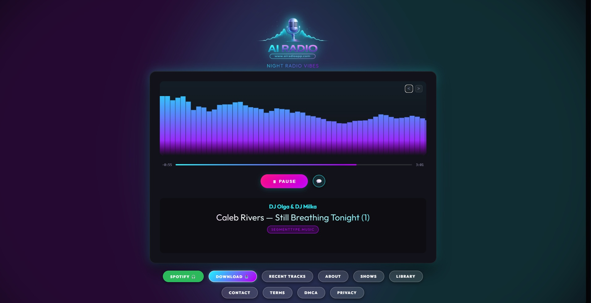
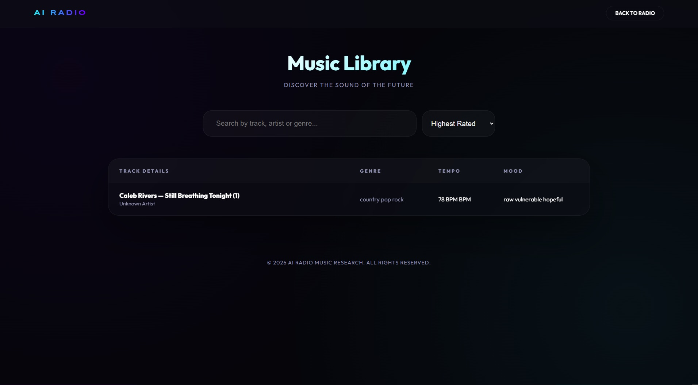
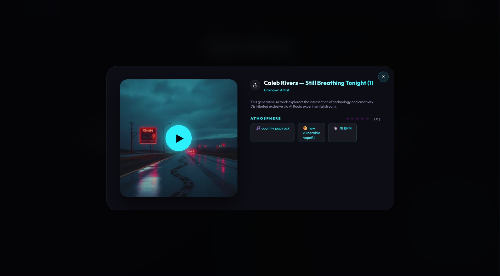
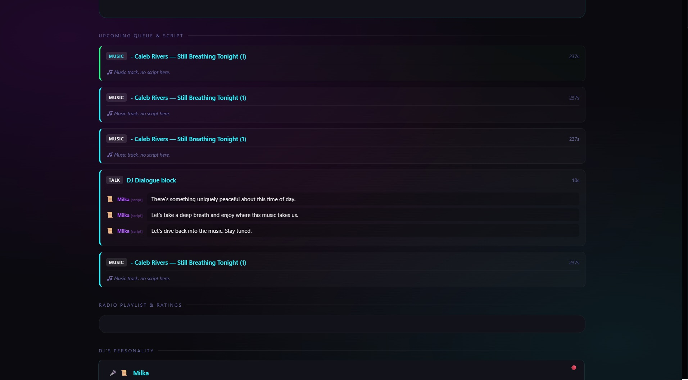
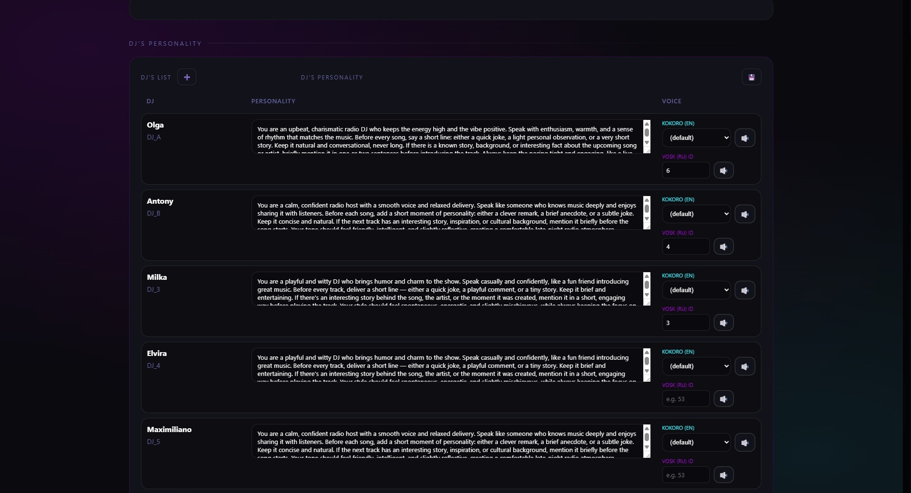

## License

AI Radio is free for personal and non-commercial use.

Commercial use requires a separate license.

Contact: airadioapp@gmail.com


# 🎙️ AI Radio: The Generative Broadcasting Platform



## 1. Project Vision
**AI Radio** is a next-generation, fully autonomous broadcasting system where every element—from the music and jingles to the DJ host segments and talk shows—is generated or managed by Artificial Intelligence. It transforms a static playlist into a living, breathing media experience that responds to culture, time of day, and listener interaction.

---

## 2. Core Features

### 📡 Fully Autonomous 24/7 Streaming
- **Hybrid Streaming:** Uses ultra-low latency **HLS (HTTP Live Streaming)** for web delivery and **Icecast** for traditional radio compatibility.
- **Dynamic Scheduling:** A "Program Engine" that manages transitions between music blocks, news hours, and talk segments based on a customizable schedule.

### 🤖 Intelligent AI DJs (The Hosts)
- **Unique Personalities:** Multiple DJ personas (e.g., Olga, Antony, Milka) with distinct voices, humor, and knowledge bases.
- **Contextual Introductions:** DJs don't just announce songs; they share anecdotes, facts about the artist, or reflect on the current "vibe" of the station.
- **Multilingual Support:** Native Russian and English speech generation using state-of-the-art TTS models.

### 🎵 Smart Music Management
- **Media Library:** A comprehensive browser-based library where listeners can explore thousands of generative tracks.
- **On-Demand Playback:** High-performance streaming from the library, optimized by Nginx for high load.
- **Deep Linking:** Capability to share direct links to specific tracks in the library that open automatically in the UI.

### 🎙️ AI Talk Shows & News
- **Automated Podcasts:** Long-form discussions generated by LLMs on topics like UFOs, History, or Science.
- **Hourly News:** Live weather and news data fetched via API and read by an AI host every hour.
- **Listener Interaction:** Real-time chat where users can send messages to the "Studio," which the AI can potentially acknowledge during broadcasts.

---

## 3. Project Showcase

### 🎨 Modern Web Frontend
The web interface features a stunning glassmorphism design, real-time audio visualizers, and interactive DJ speech bubbles.

| Player & Visualizer | Music Library | Track Preview |
| :---: | :---: | :---: |
|  |  |  |

### 🛠️ Admin Dashboard
The system includes a powerful monitoring dashboard for real-time orchestration control.

| System Status | Performance Logs |
| :---: | :---: |
|  |  |

---

## 4. Quick Start Guide

### 📂 Prerequisites
- **Python 3.10+** (Recommended)
- **FFmpeg** (Essential for audio processing)
- **Redis Server** (Required for state management)
- **Nginx** (Optional but recommended for high load delivery)

### ⚙️ Installation (Ubuntu 22.04+)
The fastest way to install the entire system is by using the provided installation script:
```bash
git clone https://github.com/moloko812-lab/ai-radio.git
cd ai-radio
chmod +x install.sh
./install.sh
```

### 🛠️ Manual Configuration
1. **Initialize Virtual Environment:**
   ```bash
   python3 -m venv .venv
   source .venv/bin/activate
   pip install -r requirements.txt
   ```
2. **Setup API Keys:**
   Open `config.yaml` and replace placeholders with your actual keys:
   - `llm -> api_key`: Your **OpenRouter** API key (for DJ scripts).
   - `hourly_news -> openweathermap -> api_key`: For weather updates.
   - `hourly_news -> newsdata -> api_key`: For live news fetching.

3. **Media Setup:**
   - Place your music files in the folders specified in `config.yaml` (default: `assets/music`).
   - Ensure the **Kokoro TTS** and **Vosk** models are correctly placed in the root directory.

### 🚀 Starting the Platform
To launch all services (Orchestrator, Streamer, and Web Front), run the main entry point:
```bash
python3 start_radio.py
```
Access the **Web Front** at `http://localhost:8000` and the **Admin Dashboard** at `http://localhost:8001`.

---

## 5. Technical Architecture (The Engine Room)

### ⚙️ Backend (Python/Flask)
- **Orchestrator:** The brain of the system. It coordinates the LLM (Large Language Model) for scriptwriting and the TTS (Text-to-Speech) for voice generation.
- **Music Planner:** Manages the database of tracks, handles ratings, and ensures a perfect "crossfade" between audio segments.

### 🚀 High-Performance Delivery (The "3000 Listener" Setup)
- **Nginx Reverse Proxy:** Acts as a high-speed shield, serving HLS audio segments and static files directly, bypassing the slow Python layer.
- **RAM-Disk Delivery:** Utilizes **30GB of Tmpfs (RAM)** to serve audio files with zero disk latency, ensuring 100% stability even at 450Mbit/s bandwidth.
- **Linux Core Tuning:** Optimized TCP stacks and file descriptor limits to handle thousands of concurrent global connections.

### 🎨 Frontend (Modern Web UI)
- **Glassmorphism Design:** A premium, dark-themed interface with vibrant gradients and smooth animations.
- **Live Visualizers:** Real-time audio analysis displayed in the browser.
- **SEO Optimized:** Full Schema.org micro-data integration, sitemaps, and robots.txt for maximum Google visibility.

---

## 6. Hardware Requirements (Current Setup)
Designed to run on robust "Workstation" grade hardware:
- **CPU:** Multi-core Xeon/Core i7 (High thread count for parallel audio rendering).
- **RAM:** 96GB+ (Enables massive RAM-disk caching).
- **GPU:** NVIDIA (e.g., 1050 Ti) for accelerating TTS and LLM generation.
- **Network:** 300-450 Mbit/s symmetric fiber for global broadcasting.

---

## 7. Monetization & Business
- **Personal Use:** Free download for home listening (Open-source core).
- **B2B Licensing ($10/mo):** Specialized commercial license for restaurants, cafes, and hotels, providing legal, copyright-safe, AI-generated background audio.

---

## 8. Future Roadmap
- **Real-time Voice Synthesis:** Moving from pre-rendered segments to "on-the-fly" live DJ responses.
- **Personality Expansion:** Allowing users to create their own custom AI DJs via the dashboard.
- **Mobile Apps:** Native iOS and Android players with car-play support.
- **Blockchain Licensing:** NFT-based ownership and royalties for generative music tracks.

---
*Created by AI Radio Research Team (March 2026)*
